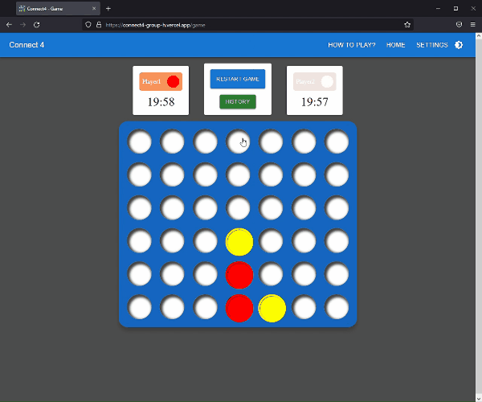

<!-- 参考 -->
<!-- https://qiita.com/koeri3/items/f85a617dcb6efebb2cab -->
<!-- https://qiita.com/aocattleya/items/5f836e9c65ba3eb3af03 -->

<p align="center">
    
</p>
<h1 align="center">Connect4</h2>

<p align="center">
    <a href="https://ja.reactjs.org/"></a><br>
</p>

# :globe_with_meridians: App URL
https://connect4-group-h.vercel.app/

# :syringe: Install
```bash
git clone https://github.com/Fanta335/Connect4-GroupH.git
npm install
npm start
```
:point_right: http://localhost:3000

# :speech_balloon: Usage
1. ホーム画面からゲームモードを選択します
1. 石を置きたい列をクリックし、Player1とPlayer2もしくはCPUで交互に石を置いていきます
1. 先に縦・横・斜めのいずれかで4つ連続で石を並べた方が勝ちです


# :package: Features
## 選べる対戦モード :video_game:
ホーム画面にてGame Modeを選択できます

- vs Player
    
    プレイヤー同士の対戦ができます

- vs CPU
    
    CPUとの対戦ができます
    
    強さはEasy/Medium/Hardから選べます

## ゲームのカスタマイズ :wrench:
設定画面からゲームに関するいくつかの設定を変更することが可能です

| 項目 | 意味 |説明 |
| --- | --- | --- |
| Player Name | プレイヤーの名前 | ゲーム画面で表示するプレイヤーの名前 |
| Disc Color | 石の色 | ゲーム画面で使用する石の色 |
| Board Size | 盤面のサイズ | デフォルトは Height: 6, Width: 7 |
| Victory Condition | 勝利条件 | デフォルトは4で、縦・横・斜めに石を4つ揃えると勝ち |
| Time Control | 持ち時間 | 持ち時間制になっており、各プレイヤーにここで設定した時間が与えられる |

## 手番の履歴 :scroll:
ゲームの手番を戻すことができます

## ライトモード/ダークモード :first_quarter_moon:
画面左上のスイッチからダークモードとライトモードを切り替えられます

# :ticket: License

- [MIT](https://raw.githubusercontent.com/aocattleya/Ramen-Timer/master/LICENSE)  

# :construction_worker: Contributors

<table>
  <tr>
    <td align="center"><a href="https://github.com/YuyaNakamura0139"></td>
    <td align="center"><a href="https://github.com/y0uk1"></td>
    <td align="center"><a href="https://github.com/kingyo298"></td>
    <td align="center"><a href="https://github.com/Fanta335"></td>
  </tr>
</table>